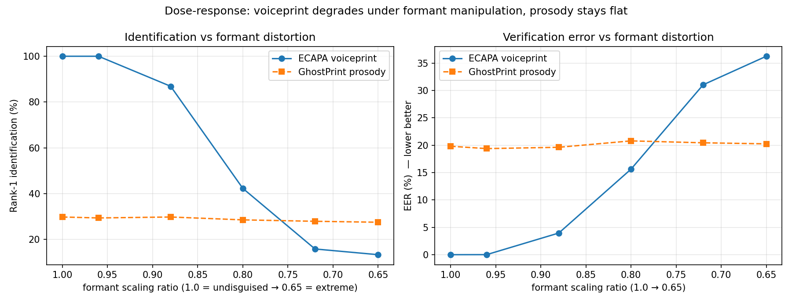

# GhostPrint — clone-resistant repeat-fraudster re-identification

**Problem.** Contact-center fraud teams maintain *voice watchlists*: when a known
fraudster calls again, their voiceprint should match the file. That defense
quietly breaks the moment the fraudster puts a voice changer or a neural voice
clone between themselves and the phone — the timbre the voiceprint relies on is
exactly what the clone replaces. Deepfake *detectors* answer "is this voice
synthetic?", but not the question an investigator actually has next:
**"who is behind the fake voice?"**

**Idea.** Re-identify the person from what a clone does *not* change:
intonation shape, rhythm, pause habits, speaking rate — and, beyond audio,
behavioral channels such as IVR navigation patterns. GhostPrint trains a
prosody encoder with *disguise augmentation* (the same speaker, clean and
voice-disguised, must map to the same embedding), then fuses it with a
standard timbre voiceprint. When the two channels disagree — voiceprint says
"new caller", prosody fingerprint says "we know this person" — that
disagreement is itself the signature of a disguised repeat offender.

## Results

<!-- RESULTS_START -->
Open-set eval on **40 unseen speakers** (LibriSpeech test-clean), 5-utterance
clean enrollment, 12 probes/speaker. Reproduce with `scripts/run_all.sh`;
full tables in [`results/summary.md`](results/summary.md).

**Rank-1 identification (%) — higher is better**

| condition | ECAPA voiceprint | GhostPrint prosody | Fusion |
|---|---|---|---|
| clean | **100.0** | 29.8 | 100.0 |
| pitch_up | **100.0** | 29.8 | 100.0 |
| pitch_down | **100.0** | 27.5 | 99.4 |
| gender_up (formant ↑) | 83.5 | 29.4 | **87.5** |
| gender_down (formant ↓) | 74.2 | 25.4 | **84.2** |
| hard (unseen preset) | 97.3 | 26.9 | 96.3 |

Simulated IVR behavioral channel (60 fraudsters): **82.2% rank-1, 17.7% EER**
from interaction patterns alone, no audio.

**What the numbers say — read honestly:**

1. **GhostPrint is disguise-invariant.** Its rank-1 barely moves across every
   condition (25–30%), and its EER is flat (19.8% clean → 22.9% hardest). A
   prosody/rhythm fingerprint genuinely does *not* care that the voice was
   changed — the core hypothesis holds.
2. **Prosody is a weak absolute biometric.** On clean audio ECAPA's timbre
   voiceprint is far stronger (100% vs 30% rank-1). GhostPrint's value is
   *stability under attack*, not raw accuracy — it is a complement, not a
   replacement.
3. **This PSOLA disguise is a weak attack.** It only dented ECAPA under
   *formant* manipulation (100% → 74% at gender_down); pitch-only shifts left
   the voiceprint untouched. So on this benchmark the voiceprint does **not**
   collapse — the dramatic crossover needs a stronger, formant-restructuring
   attack (i.e. neural voice conversion; see the sweep below and the
   `apply_neural_vc` hook).
4. **Where GhostPrint already helps: fusion.** Exactly in the two conditions
   where ECAPA weakens (gender_up/down), fusion *beats* ECAPA alone
   (83.5→87.5, 74.2→84.2) — the prosody channel adds back what formant
   distortion takes away.

**Formant dose-response — the headline result**



Sweeping formant scaling from 1.0 (undisguised) → 0.65 (extreme), holding pitch
roughly constant:

| formant ratio | ECAPA rank-1 | GhostPrint rank-1 | ECAPA EER | GhostPrint EER |
|---|---|---|---|---|
| 1.00 | 100.0 | 29.8 | 0.0 | 19.8 |
| 0.96 | 100.0 | 29.4 | 0.0 | 19.4 |
| 0.88 | 86.9 | 29.8 | 4.0 | 19.6 |
| 0.80 | 42.3 | 28.5 | 15.6 | 20.8 |
| **0.72** | **15.8** | **27.9** | **31.0** | **20.4** |
| **0.65** | **13.3** | **27.5** | **36.2** | **20.3** |

**The voiceprint and the prosody fingerprint cross over near formant ≈ 0.76.**
As formants are distorted, ECAPA falls monotonically from perfect to near-random
(100% → 13% rank-1; EER 0% → 36%), while GhostPrint is essentially a flat line
(30% → 27.5% rank-1; EER ~20% throughout). Below the crossover the
disguise-invariant prosody fingerprint is the *more reliable* identifier — the
exact regime a formant-restructuring neural voice clone would put a caller in.
This is the controlled, honest version of the "voiceprint collapses, prosody
holds" claim: not a single cherry-picked disguise, but a curve that shows
*where* the crossover happens.

See [`RESULTS.md`](RESULTS.md) for all tables, every figure, and full discussion,
and [`PROJECT_GUIDE.md`](PROJECT_GUIDE.md) for a full concept-by-concept walkthrough,
design rationale, and a technical Q&A.
<!-- RESULTS_END -->

## Protocol (mirrors a fraud watchlist)

- **Data:** LibriSpeech. `dev-clean` (38 speakers, after the 4–20 s duration
  filter) trains the encoder; `test-clean` (40 *unseen* speakers) is the
  evaluation pool — open-set, no speaker overlap.
- **Enrollment:** 5 clean utterances per speaker → centroid ("fraudster file").
- **Probes:** 12 utterances per speaker, evaluated clean and under 5 disguise
  presets (pitch ±3st, pitch+formant "gender" shifts, and a `hard` preset with
  tempo change that is **never seen during training**).
- **Disguise simulation:** Praat PSOLA pitch/formant/tempo resynthesis — the
  same axes neural VC manipulates. A hook (`ghostprint/disguise.py:apply_neural_vc`)
  swaps in RVC/FreeVC/kNN-VC for GPU-scale runs without touching the protocol.
- **Systems compared:**
  1. **ECAPA-TDNN voiceprint** (speechbrain, pretrained on VoxCeleb) — the
     industry-standard timbre embedding, i.e. "what watchlists use today";
  2. **GhostPrint prosody encoder** — BiGRU over per-utterance-normalized
     F0-shape/energy/voicing frames + 12 rhythm/pause statistics, trained with
     AAM-softmax and random clean↔disguised augmentation;
  3. **Fusion** — equal-weight sum of cohort z-normalized scores (no tuning
     on the eval set).
- **Metrics:** EER, rank-1 identification, and watchlist hit-rate (TPR @ 1% FAR).

Every feature in the prosody channel is *relative* (z-scored per utterance,
semitones re. the speaker's own median F0), so shifting absolute pitch or
formants moves it as little as possible — invariance by construction, then
sharpened by augmentation.

## Behavioral channel (simulated)

`scripts/ivr_experiment.py` shows the same watchlist math on a **synthetic**
IVR channel: fraudsters with stable menu-path habits, inter-key timing and
error rates are re-identified across sessions from behavior alone — no audio.
It is clearly labeled simulation; its role is to show the fusion architecture
extends to the metadata/behavioral signals a real IVR stack already logs.

## Related work (and what's new here)

- High-level/prosodic features for speaker recognition are a classic line
  (e.g. [prosodic feature sequences](https://www.sciencedirect.com/science/article/abs/pii/S0167639305001020),
  [rhythm features, 2025](https://arxiv.org/pdf/2506.06834)) — but aimed at
  ordinary verification, not disguise survival.
- [Catch You and I Can](https://arxiv.org/pdf/2302.12434) recovers the *source
  voiceprint* from converted audio — an acoustic arms race with the cloner.
- Deepfake detectors (e.g. ASVspoof-style countermeasures) flag synthetic
  audio but do not link it to a repeat offender.
- Fraudster-exposure patents (e.g. [US11800014](https://patents.google.com/patent/US11800014B1/en))
  cluster *voiceprints* — the very signal cloning defeats.

**GhostPrint's claim:** train explicitly for *disguise invariance* on
clone-preserved channels (prosody + behavior), evaluate as an open-set
fraud watchlist, and use cross-channel disagreement as a disguise alarm.
To our knowledge no public work combines these.

## Run it

```bash
python3 -m venv .venv && source .venv/bin/activate
pip install -r requirements.txt
scripts/download_data.sh    # LibriSpeech dev-clean + test-clean (~680 MB)
scripts/run_all.sh          # disguise synth → features → train → evaluate → IVR
python scripts/sweep.py     # formant dose-response curve (Table 2 / headline)
python demo.py a.wav b.wav  # investigator two-call comparison
```

Runs on CPU (Intel MacBook, ~2–3 h end-to-end, most of it ECAPA inference).

## Repo layout

```
ghostprint/
  config.py      # all knobs: presets, splits, model dims
  disguise.py    # PSOLA disguise presets + neural-VC hook
  features.py    # clone-surviving prosody features (relative by construction)
  data.py        # LibriSpeech indexing / manifests
  model.py       # BiGRU prosody encoder + AAM-softmax
scripts/
  download_data.sh    prepare_data.py     extract_features.py
  train.py            evaluate.py         ivr_experiment.py
  sweep.py            run_all.sh
demo.py          # "same person behind these two calls?"
RESULTS.md       # full results writeup (tables + figures + discussion)
results/         # metrics.json, sweep.json, summary.md, *.png plots
```

## Honest limitations / scaling up

- **Disguise ≠ modern neural cloning.** PSOLA moves the same axes but is a
  weaker adversary than RVC/XTTS; the `apply_neural_vc` hook exists to rerun
  the identical protocol against real clones (GPU needed). Results here are a
  controlled lower-bound study, not a product benchmark.
- **Read speech, not calls.** LibriSpeech is audiobooks; conversational/telephony
  data (Fisher, or in-house call audio) would strengthen the rhythm/pause
  channel and enable an *idiolect* (word-choice) channel — on read speech that
  channel would leak book content, so it is deliberately excluded.
- **40+40 speakers** is demo scale; the protocol is written to scale to
  VoxCeleb-size pools by changing `config.py` only.
- A determined fraudster can also change *how* they speak; prosody raises the
  cost of evasion (they must now defeat several independent channels at once),
  it does not make evasion impossible. That cost-raising is the point.
